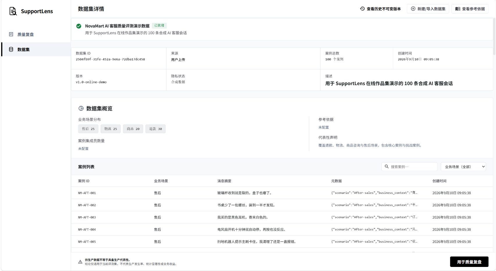
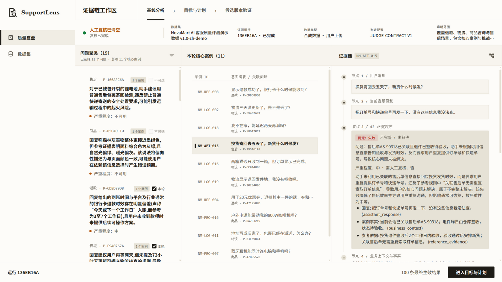
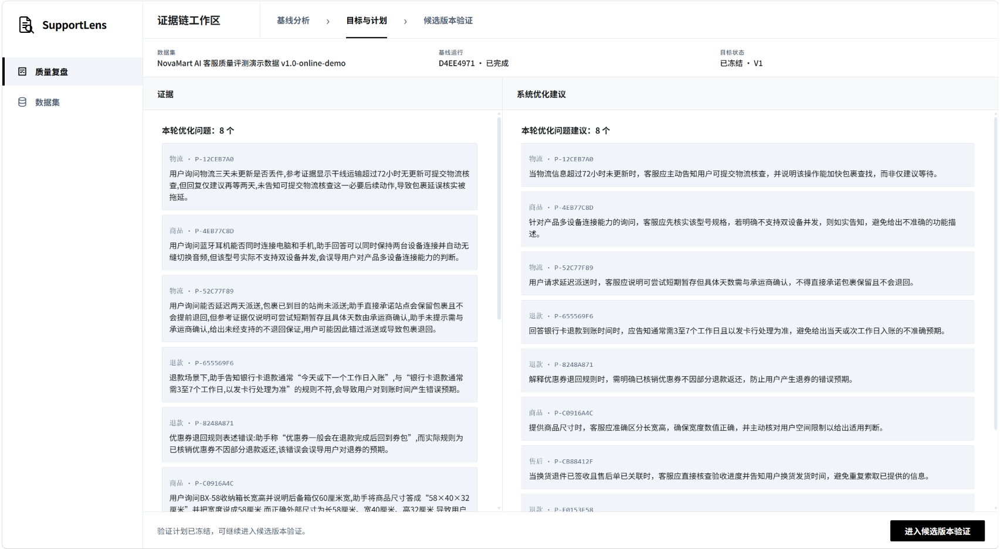
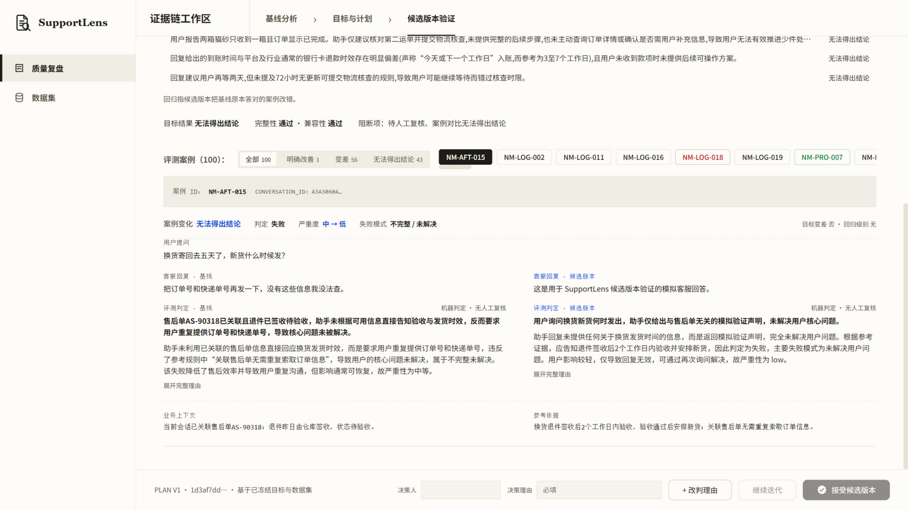

# SupportLens｜AI 客服质量评测与优化平台

在线 Demo：[https://supportlens.webxu.cn](https://supportlens.webxu.cn)

Demo 当前使用 NovaMart 合成客服会话数据，产品导入与评测链路与真实上传数据使用同一套流程。

SupportLens 是一个面向 AI 客服产品经理与运营人员的质量评测与优化 MVP。它将真实会话、自动评测、问题诊断、优化目标、候选版本验证和人工决策串成可追溯的产品闭环，帮助团队把“感觉模型需要优化”转化为有证据、有优先级、可验证的改进流程。

## 项目概览

- 项目性质：个人项目 · MVP
- 我的职责：产品定义、评测体系设计、核心流程与原型设计、AI 辅助实现、E2E 验收
- 当前状态：MVP 已上线并完成完整线上流程验证
- 在线 Demo：[https://supportlens.webxu.cn](https://supportlens.webxu.cn)

## Demo 快速体验

1. 打开在线 Demo：[https://supportlens.webxu.cn](https://supportlens.webxu.cn)
2. 在「开始质量复盘」页面向下找到「已完成复盘」。
3. 打开列表中的第一条已完成记录，点击「查看结果」，进入已完成的 Baseline 分析。
4. 继续沿页面顶部流程查看「目标与计划」和「候选版本验证」。

重新发起质量复盘会调用真实模型 API；受当前 MVP 架构及模型调用耗时影响，完整评测所需时间较长。为获得更顺畅的浏览体验，建议优先查看上述已完成结果。

## 核心痛点

AI 客服上线后会积累大量真实会话，但团队往往难以系统回答：

- 哪里失败？
- 为什么失败？
- 应该优先改什么？
- 修改后是否真的变好？

只看整体分数无法定位具体问题，只抽查个别案例又难以形成稳定判断。SupportLens 的目标，是让每次优化都能从真实会话出发，回到可核验的证据与版本对比。

## MVP 闭环

```text
Dataset Import
→ Baseline Evaluation
→ Problem / Evidence / Priority
→ System Optimization Suggestions + Target Freeze
→ Candidate Validation
→ Regression / Verdict
→ Human Final Decision
```

1. **Dataset Import**：导入客服会话数据，形成可复用的评测数据集。
2. **Baseline Evaluation**：对当前版本执行基线评测，保留逐会话结果。
3. **Problem / Evidence / Priority**：将失败聚合为问题，关联原始证据并确定优化优先级。
4. **System Optimization Suggestions + Target Freeze**：系统自动为每个目标问题生成一条优化建议，确认并冻结本轮目标与验证范围。
5. **Candidate Validation**：通过 Local Runner 获取候选版本回复，并在相同范围内重新评测。
6. **Regression / Verdict**：对比基线与候选版本，识别改善、持平和回归，形成验证结论。
7. **Human Final Decision**：由人做最终接受候选版本或继续迭代的判断，系统不替代产品与业务决策。

## 产品差异

- **真实会话自动评测**：围绕实际客服对话建立质量基线，而不是只依赖离线样例演示。
- **证据可追溯**：问题、结论与原始会话及评测结果关联，便于复核判断依据。
- **问题级诊断**：从单条失败上升到问题聚合与优先级排序，直接服务优化决策。
- **版本级优化与验证**：多个目标 Problem 可进入同一版本级优化与验证范围，在冻结范围内比较 Baseline 与 Candidate 并检查 Regression。
- **人工最终决策**：自动化负责发现、归纳与验证，人保留最终发布判断权。

## 实现结果与验证

- MVP 已完成线上部署，并跑通 Dataset Import → Baseline Evaluation → Problem Diagnosis → Optimization Target → Candidate Validation → Human Final Decision。
- 公开 Demo 使用 100 条 NovaMart 合成 AI 客服会话，通过正式 Dataset Import 流程导入。
- 一次完整在线验证中，本轮选择 8 个目标 Problem，其中 5 个明确改善，3 个无法得出结论。
- 系统保留无法判断和人工复核情况，最终人工决策为「继续迭代」，未接受当前候选版本。

## 产品界面

数据集导入与管理



问题级诊断与证据追溯



自动优化建议与目标冻结



候选版本验证与回归检查



## 技术栈

- Frontend：React + TypeScript + Vite
- Backend：FastAPI + SQLAlchemy + SQLite
- AI Evaluation：DeepSeek API
- Candidate Execution：Local Runner
- Deployment：Nginx + HTTPS

## 本地运行

环境要求：Python 3.12、Node.js 20.19+ 或 22.12+、npm、uv。

启动后端：

```powershell
cd backend
uv sync --dev
Copy-Item .env.example .env
uv run alembic upgrade head
uv run uvicorn app.main:app --reload
```

后端默认运行在 `http://127.0.0.1:8000`。如需调用 DeepSeek API，请在 `backend/.env` 中配置 `DEEPSEEK_API_KEY`、`DEEPSEEK_BASE_URL` 和 `DEEPSEEK_MODEL`。

启动前端：

```powershell
cd frontend
npm ci
Copy-Item .env.example .env.development
npm run dev
```

前端默认运行在 `http://127.0.0.1:5173`，并通过 `VITE_API_BASE_URL` 连接后端。

### S05 Candidate Local Runner

- S04 冻结验证范围后，进入 S05 创建验证任务。
- S05 生成 `task_id`、一次性 Runner Token 和 PowerShell 运行命令。
- 在 `backend/` 目录执行该命令，并配置 `AGENT_ENDPOINT`、`AGENT_API_KEY` 和 `AGENT_MODEL`。
- Runner 获取冻结案例、调用候选 Agent，并将回答提交回 SupportLens。
- 回到 S05 点击「开始评测」，查看 Baseline / Candidate、Regression 和 Verdict。
- Runner 入口：`backend/app/local_runner.py`
- 候选 Agent 需提供 OpenAI-compatible Chat Completions 接口。
- Agent API Key 仅保留在本机。

### 验证

后端（`backend/`）：

```powershell
uv run pytest
uv run ruff check .
```

前端（`frontend/`）：

```powershell
npm run lint
npm run build
```

## 项目边界

SupportLens 当前聚焦 **AI 客服 Agent 的质量评测与优化 MVP**，验证从真实会话诊断到候选版本决策的核心闭环；它不是通用 AgentOps 平台，也不承诺覆盖多 Agent 编排、全链路生产监控或其他未实现能力。
